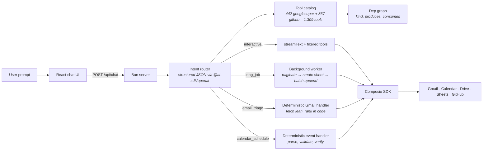
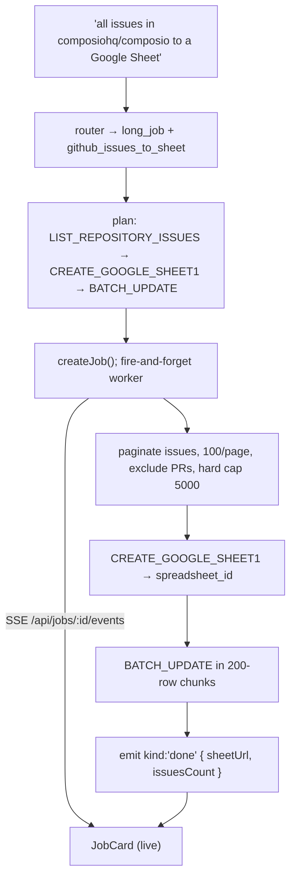
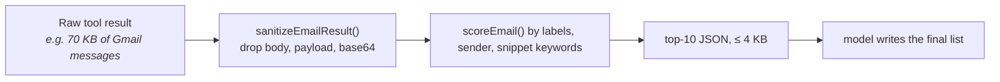

# mini-rube · a general agent on top of composio

Submission for the Composio engineering take-home. A web app that chats over Gmail, Calendar, Drive, Sheets and GitHub through Composio's tool catalog — not by stuffing every tool into an LLM loop, but by routing the prompt through an intent classifier, a small in-process **tool dependency graph**, and deterministic handlers for the workflows where correctness actually matters.

The dependency graph is the practical reuse of my previous dep-graph submission — except the previous one was an offline analytical artifact; here it's wired into a live planner.

## why generic tool calling wasn't enough

The naive shape of this assignment is: pull all 1,309 Composio tools (Google Super + GitHub), hand them to the model, let it figure it out. That breaks in four predictable ways and I hit every one:

| problem | what actually happened | the fix |
|---|---|---|
| **context overflow** | `GOOGLESUPER_FETCH_EMAILS` with `max_results: 100` returned 2.5M tokens of base64 attachments. Single 400 from OpenAI. | Bypass the tool loop for `email_triage`: server fetches lean, sanitizes + ranks in code, only feeds the model the top-10 compact JSON for wording. |
| **hallucinated success** | "Schedule a meeting in 5 mins" → assistant replied "Scheduled for tomorrow at 3 PM" without calling the tool. | Bypass the tool loop for `calendar_schedule`: code parses time/duration/attendee, validates, calls `CREATE_EVENT`, builds the user-facing answer from the actual `htmlLink` only. Never trusts the model with a confirmation phrase. |
| **wrong-action selection** | "Read my last 100 emails and show me the important ones" → model picked `GOOGLESUPER_BATCH_MODIFY_MESSAGES` and tried to add the IMPORTANT label. | Per-intent allow/deny pattern set + a runtime block in the tool wrapper that refuses mutating slugs when the routed intent is read-only. |
| **long-job blowup** | "All issues in composiohq/composio to a Sheet" — model would either skip pagination or try to stream every issue back through itself. | Long jobs are deterministic background workers: a dep-graph-derived chain runs pagination → sheet creation → batch append entirely server-side; the model only fires the initial intent, then the user sees a streaming `JobCard`. |

## the dep graph, used as a planner

`src/lib/depGraph.ts` is ~150 lines and does three things:

1. **classifies every tool** as `read` / `create` / `update` / `delete` by slug regex.
2. **infers consumed entities** from each tool's real JSON-schema property names (so `spreadsheet_id`, `spreadsheetId`, `spreadsheet.id` all collapse to `spreadsheet_id`).
3. **infers produced entities** from slug patterns (`CREATE_GOOGLE_SHEET*` produces `spreadsheet_id`; `LIST_REPOSITORY_ISSUES` produces `issue_number`, etc.) — conservative; only patterns where we've verified a usable output.

That's enough to answer "to use tool X, which earlier tool do I need to call first?" — the only question a planner asks in a chat context.

```ts
// suggesting an upstream chain for a long job
suggestChain("GOOGLESUPER_BATCH_UPDATE", nodes)
// → ["GOOGLESUPER_CREATE_GOOGLE_SHEET1", "GOOGLESUPER_BATCH_UPDATE"]
//   because BATCH_UPDATE consumes spreadsheet_id, and CREATE_GOOGLE_SHEET1
//   is the closest same-toolkit producer of spreadsheet_id.
```

The graph is used at runtime as:
- the **filter** for read-only intents (any slug whose `kind === "delete" | "create" | "update"` is rejected when the intent is read-only),
- the **plan** that gets emitted into `JobCard.plan` for long jobs (so the user sees the actual chain in the UI),
- the **lookup** that picks a contacts-search tool when a send-email turn has a bare name and no `@`.

## architecture



### interactive turn (the common case)

```mermaid
sequenceDiagram
  participant U as User
  participant R as Router
  participant F as Intent filter
  participant E as streamText
  participant C as Composio
  participant A as Google/GitHub

  U->>R: "send an email with the attached PDF"
  R->>R: classify intent + extract slots
  R->>F: candidate tools from shortlist
  F->>F: drop tools whose kind violates intent
  F->>F: inject deterministic recovery if needed
  F-->>E: minimal tool set
  E->>C: SEND_EMAIL(args)
  Note over C: server wrapper auto-stages uploaded<br/>file via composio.files.upload and<br/>rewrites attachment to {name, mimetype, s3key}
  C->>A: Gmail send
  A-->>C: 200 + messageId
  C-->>E: result
  E-->>U: confirmation grounded in real result;<br/>frontend clears the attachment chip<br/>on kind:"action_success" event
```

### long-job turn (deterministic)



### context safety



A hard token guard keeps the final payload to the model under 40 KB regardless of how many emails come back. The model is never shown the raw Composio response.

## what each intent does

| intent | path | who writes the final answer |
|---|---|---|
| `conversational` | router fast-path, no tools | model |
| `email_triage` | deterministic handler in `lib/handlers/emailTriage.ts` | model formats the pre-ranked top-10 from server-prepared JSON |
| `send_email` | `streamText` + intent-filtered tool map. Tool wrapper auto-stages attachments via `composio.files.upload`. | model — but `kind:"action_success"` is only emitted after Composio confirms |
| `calendar_schedule` | deterministic handler in `lib/handlers/calendarSchedule.ts`. **No tool loop.** | server, from `formatEventSuccess(outcome)` — model has no opportunity to fabricate |
| `github_read` | `streamText` with `intent_profile.toolkits = ["github"]`; deterministic stage-2 recovery if the LLM didn't pick `LIST_REPOSITORY_ISSUES` | model |
| `github_issues_to_sheet` (long_job) | `lib/handlers/githubIssuesToSheet.ts` background worker | server emits structured `JobEvent`s; UI renders them |
| `drive_files_to_sheet` (long_job) | `lib/handlers/driveFilesToSheet.ts` background worker; concurrency-4 per-file LLM extraction | same |

## auth, attachments, progress

**auth.** Per-toolkit OAuth via Composio auth-configs (created by `scaffold.sh`). The `/api/connect/:toolkit/wait` endpoint returns JSON within 25 s and `200`s even on timeout (so the frontend can poll without parser explosions); the UI retries up to 8 times. Connection chips in the header show live state.

**attachments.** Uploads land in `$TMPDIR/mini-rube-uploads/`. They persist in React state across chat turns — the multi-turn send-email flow ("send a PDF" → "to nikhil@…" → "just say hi") needs the same attachment in scope until success. When the user actually triggers a send, a tool wrapper calls `composio.files.upload({ file: localPath, toolSlug, toolkitSlug })` to stage the file in Composio's S3 and rewrites the `attachment` argument with `{name, mimetype, s3key}`. The model is never asked for an S3 key; the system prompt explicitly forbids that question.

**progress.** Long jobs write to an in-memory `Job` with structured `JobEvent`s (`plan`, `step`, `progress`, `done`, `error`). The frontend opens an `EventSource` to `/api/jobs/:id/events` and renders a `JobCard` with the plan, step list, a progress bar, and the final result (sheet link). The same channel powers `[chat:job]` console logs for debugging.

## the contact-resolution + anti-hallucination story

These two are the bugs that made me stop trusting the generic loop.

1. **"send this to nikhil"** with no email → the model used to call `SEND_EMAIL(recipient_email: "nikhil")`, get back `"Invalid email format"`, and report failure. Now the router's send-email recovery detects the bare-name pattern, deterministically injects `GOOGLESUPER_SEARCH_PEOPLE`, and the system prompt tells the model to resolve first.
2. **"schedule a 30 min meeting in 5 mins"** → model invented "tomorrow at 3 PM" and claimed success without calling the tool. Fixed by lifting calendar scheduling entirely out of the generic loop. The handler parses "in 5 mins" → `Date.now() + 5 * 60_000` and the user-facing message is built from the calendar API's actual `htmlLink`. There is no path where the model writes the success line.

The global system prompt also has an **anti-hallucination clause** for any mutating slug that ever escapes through the generic loop: the model is forbidden from claiming a `CREATE/UPDATE/DELETE/SEND` happened unless the tool actually returned a successful result. Bare conversational follow-ups are NOT new tasks, but explicit verbs (`schedule`, `send`, `delete`) override prior context.

## tested results

Live runs against `composiohq/composio` and the assignment Drive folder:

| prompt | result |
|---|---|
| `read the last 10 open issues from composiohq/composio and make a google sheet…` | ✅ Job succeeded in <2 s. 10 issues written (count slot honoured). Sheet: `1TvgpHurZoP39K8lYfVnB1FT66w6U_66GYIh0OxZV_Ng` |
| `read all the issues open and closed on composiohq/composio…` | ✅ 31 pages paginated, **588 issues** written, PRs excluded. Sheet: `1I9SSldWDP6vZ4aMfC19xx8DRSVmYTZcXZtdbH_erI74` |
| `take all the resumes in this drive folder /1bOEE3JXX-iFqbY99VTRq1ak-UOQULc5r…` | ✅ 1000 files listed via `FIND_FILE`, processed at concurrency 4 with per-file LLM extraction; rows written for every file (filename + extracted name/university/last_job + source URL). Run time ~8 min for the full 1000. |

Schema fixes made during testing (now committed):
- `GOOGLESUPER_BATCH_UPDATE` → **`GOOGLESUPER_SPREADSHEETS_VALUES_APPEND`** (the former is deprecated by Composio; the latter is the real append surface).
- `GOOGLESUPER_LIST_CHILDREN_V2` (id-only refs) → **`GOOGLESUPER_FIND_FILE`** (returns full file metadata: name, mimeType, webViewLink). LIST_CHILDREN_V2 made every row's filename render as "(unnamed)" — switched to FIND_FILE which returns `resume_1000_Steven_Moore.pdf` etc.

## how to run

```sh
# scaffold + .env (uses your COMPOSIO_API_KEY to create auth-configs and fetch
# the OpenRouter key bundled with the take-home)
COMPOSIO_API_KEY=ak_xxx sh scaffold.sh

# preferred: add your own OPENAI_API_KEY (the scaffold's OpenRouter key has a
# small budget and the assignment may exhaust it)
echo "OPENAI_API_KEY=sk-..." >> .env

bun install
bun run dev
# → http://localhost:5173
```

Connect Google + GitHub via the chips in the header. Try:

- `read my last 100 emails and show me the important ones`
- `schedule a 30 min meeting with sahil.jagtap45@gmail.com in 5 mins`
- `summarize the last 5 open issues from composiohq/composio`
- `read all issues in composiohq/composio and make a Google Sheet of the problems`  *(long job)*
- `take all the resumes in this drive folder https://drive.google.com/drive/folders/<id> and put name, university and last job into a Google Sheet`  *(long job)*
- Upload a PDF via the paperclip, then: `Send an email with the attached PDF` → reply with recipient → `just send him hi`

Two safe smoke scripts are included:

```sh
bun scripts/smoke-route.ts    # 13 routing assertions against /api/route (no mutations)
bun scripts/smoke-email.ts    # 4 email-triage-only routing assertions
```

## known limitations

- **All state is in-memory.** Uploaded files, the job store, pending OAuth links, the dep-graph cache, the connected-toolkits cache — none of it survives a `bun run dev` restart. The 1000-file Drive job that succeeded today would have to re-run from scratch after a restart. Production would persist jobs to Postgres + S3 (or use Composio's own storage). I made this trade-off explicitly to keep the take-home runnable without infra.
- **PDF text extraction quality depends entirely on what `GOOGLESUPER_DOWNLOAD_FILE` returns.** For Google-native formats (Docs, plain text) the tool returns extracted text; for binary PDFs the extracted text can be partial or empty. The Drive→Sheet job records what it gets — `name`, `university`, `last_job` may be empty strings for PDFs the downloader couldn't fully decode. Production would add `pdf-parse` for binary PDFs (the lib runs locally, doesn't need infra) or use Drive's `export` endpoint for native formats.
- **Local uploads are temporary.** `$TMPDIR/mini-rube-uploads/` is cleared by the OS periodically. The `composio.files.upload(...)` stage that gives us an S3 key for `SEND_EMAIL` runs eagerly so the email send works even if the tmp file is later removed.
- **Long-job concurrency is 4.** Drive resume extraction runs 4 files at a time. Higher concurrency would speed up 1000-resume runs but risks tripping OpenAI's `tier-1` per-minute caps — easy to bump if your project has higher limits.
- **The dep graph is heuristic.** `producesEntities()` is slug-pattern-based, not a full schema crawl. For a one-off like this it's enough; for a generalizable platform you'd embed the LLM-extracted graph from the previous submission as a static asset.
- **One-tool-per-intent guarantee is by post-filter, not by tool inventory.** If a future Composio slug ships with a brand-new mutating verb, the runtime `isMutating` regex needs an update.
- **The router's structured-JSON call is one model round-trip per turn.** Conversational greetings ("hi", "what can you do?") short-circuit before that call to keep latency low.
- **Schema-shape assumptions are pinned to what I probed live** during this submission (e.g. `SPREADSHEETS_VALUES_APPEND` arg names, `FIND_FILE` response shape). If Composio updates these surfaces, the worker would need a one-line arg-name fix — surfaced as a clear error in the `JobCard`.

## file map

```
src/
  server.ts                          Bun HTTP server, intent routing, deterministic handlers wired in
  lib/
    composio.ts                      Composio client + auth-config IDs
    catalog.ts                       toolkit-isolated catalog load + keyword shortlist + deterministic backstops
    depGraph.ts                      tool kind classification + entity inference + chain suggestion
    router.ts                        intent classifier (structured JSON) + recovery stages
    intent.ts                        per-intent allow/deny pattern set + toolkit gating
    slots.ts                         deterministic slot extractors (email count, github owner/repo, event time)
    tools.ts                         executeTool wrapper
    toolGuards.ts                    arg coercion + result size guard
    uploads.ts                       file uploads + composio.files.upload staging
    jobs.ts                          in-memory job store + SSE fan-out
    handlers/
      emailTriage.ts                 deterministic gmail handler
      calendarSchedule.ts            deterministic event handler
      githubIssuesToSheet.ts         long-job: issues → sheet
      driveFilesToSheet.ts           long-job: drive folder → sheet
  app/
    App.tsx                          chat UI shell
    components/
      Composer.tsx                   message composer + attachments
      ConnectionChips.tsx            Google/GitHub connection state
      EmptyState.tsx                 landing screen suggestions
      Message.tsx                    one chat message (markdown rendering)
      MessageList.tsx                pairs messages with route meta + triage stats
      RunPanel.tsx                   per-message run timeline + collapsed "show run details"
      JobCard.tsx                    long-job progress card (live SSE)
      ErrorCard.tsx                  inline error surfacing
      serviceIcons.tsx               brand SVG marks (Google G, GitHub octocat)
      icons.tsx                      lucide check / x / chevron etc.
    utils/
      toolService.tsx                slug → {service, label, icon} mapping
scripts/
  smoke-route.ts                     13-case routing smoke test
  smoke-email.ts                     4-case email-triage routing smoke test
```

---

The original brief is preserved at [`original-brief.md`](./original-brief.md).
